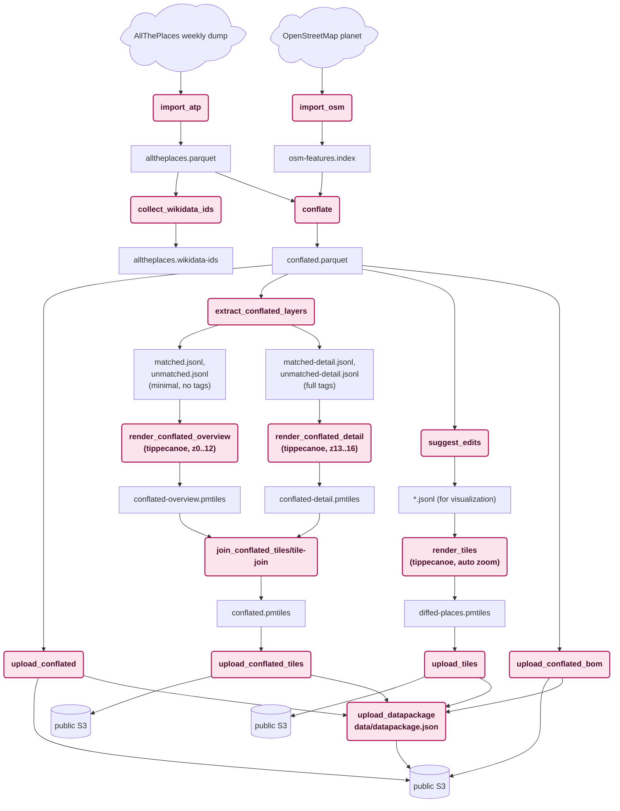

# Technical design: `osmdiffs`

Status: Work in Progress — see [“Status”](#status) at the end of this
document for what’s still ahead.

## Objective

Compute a weekly diff between [AllThePlaces](https://alltheplaces.xyz/)
(a large, open database combining point-of-interest scrapes with
Open Government Data) and
[OpenStreetMap](https://www.openstreetmap.org/about), and turn that
diff into edit suggestions that a human can review and, if correct,
apply to OpenStreetMap.

## Background

### Why OpenStreetMap needs this

OpenStreetMap’s coverage of roads and administrative boundaries is
comprehensive. Points of interest are a different story: a shop,
restaurant, or other business only ends up on the map if a volunteer
happened to notice it and add it by hand — while most retail and
hospitality chains already publish exactly this information
themselves, as store locators and branch listings, because they want
customers to find them.

AllThePlaces exists to scrape that already-public data at scale, and
the OSM Foundation’s [Licensing Working
Group](https://osmfoundation.org/wiki/Licensing_Working_Group) has
[confirmed](https://osmfoundation.org/wiki/Licensing_Working_Group/Minutes/2023-08-14#Ticket%232023081110000064_%E2%80%94_First_party_websites_as_sources)
first-party websites as an acceptable data source for OSM.
In addition, AllThePlaces ingests various datasets, published under
clearly declared open-data licenses — municipal infrastructure,
government records, and more — so its scope reaches beyond retail
POIs, even though those still make up most of what it processes
today.

This project doesn’t apply bulk edits to OpenStreetMap, and has no
plans to: scraped data isn’t reliable enough to trust unreviewed, and
even if it were, bulk edits don’t fit how the OSM
community works — edits get proposed and reviewed by humans, not
pushed automatically by a script. What this project can do instead:
find the delta between the two datasets systematically, for the
whole planet, within a week, and turn it into edit proposals for
volunteers to review — turning “maybe someone notices eventually” into
a standing, repeatable check.

### What conflation is

“Conflation” is the general [GIS](https://en.wikipedia.org/wiki/Geographic_information_system)
term for combining two independently
produced geospatial datasets that describe overlapping real-world
features, so as to reconcile them into one better (or at least
cross-checked) result. It’s an old problem in GIS, going back to
combining paper maps and different survey sources long before
crowdsourced data existed; see the [OpenStreetMap wiki’s Conflation
page](https://wiki.openstreetmap.org/wiki/Conflation) for accessible
general background, including the tooling OSM’s own community already
uses for it (Hootenanny, JOSM’s Conflation plugin, Osmose). Matching
points of interest
specifically — deciding whether a point in one dataset and a point in
another dataset describe the same real-world place — is its own
well-studied sub-problem, surveyed in [Sun et al., “Conflating point of
interest (POI) data: A systematic review of matching
methods”](https://arxiv.org/abs/2310.15320) (2023). This pipeline’s
`conflate` step (below) is a POI-conflation implementation in that
sense, deliberately simple for now — see
[`src/matchers/`](../src/matchers/) for the actual matching logic, and
its own doc comments for what it does and doesn’t consider yet.

### OpenStreetMap’s data model, briefly

OpenStreetMap data is built from three element types: **nodes** (a
single point, the only element type that actually carries
latitude/longitude), **ways** (an ordered list of node references,
used for both lines and, when closed, area outlines), and
**relations** (a list of member elements — nodes, ways, or other
relations — with a role attached to each, used for anything that
doesn’t fit as a single way, from a multipolygon lake with islands to
a bus route). See the [OSM wiki’s “Elements”
page](https://wiki.openstreetmap.org/wiki/Elements) for the full
picture. The consequence that matters for this pipeline: a “place” in
OSM might be a node, or it might be a way or relation with no
coordinates of its own, only a shape built by resolving every member
down to its constituent nodes — this project has to construct real
geometry for all three cases, not just look up a point (see
`tables::feature_index` and `pipeline::osm::assemble` for how).

### Working with data bigger than RAM

A planet-scale OSM index doesn’t fit in memory on the kind of cheap
machine this pipeline is meant to run on. The pattern used throughout
[`tables`](../src/tables/) (see “Code structure” below): build the
table on disk — usually via [external
sorting](https://en.wikipedia.org/wiki/External_sorting), the
sort-chunks-then-merge technique for sorting more data than fits in
RAM — then [memory-map](https://en.wikipedia.org/wiki/Memory-mapped_file)
the finished file instead of loading it onto the heap. From there,
virtual memory does the rest: the OS keeps only the pages actually
being touched resident, backed by its page cache, so a table can be
far bigger than physical RAM without this project doing any caching of
its own. That’s not just assumed to work — it’s been verified on real,
memory-constrained hardware, including inside a container under a real
cgroup memory limit; see [“Why `conflate` doesn’t need its own
cache”](#why-conflate-doesnt-need-its-own-cache) below, and
[#711](https://github.com/brawer/osmdiffs/issues/711) for the
full sweep.

### What AllThePlaces does

AllThePlaces runs several thousand site-specific scrapers (“spiders”),
each written in Python against the [Scrapy](https://scrapy.org/)
framework — deliberately easy to write and contribute, which is a
large part of why the project has grown as far as it has. Most spiders
target one retail chain or brand’s own store-locator page, but a
growing share instead pull from Open Government Data portals under
clear open licenses, so the combined dump isn’t retail-only. It
publishes a combined weekly dump of every spider’s output as open data
(CC0), which several other projects already consume, including
OpenStreetMap-adjacent tooling and commercial mapping platforms. As
one (deliberately brief) indicator of how active the project is: as of
this writing, its
[repository](https://github.com/alltheplaces/alltheplaces) has around
16,000 commits, 800+ stars, and roughly 180 contributors.

### The OSM maintenance-tool ecosystem

Suggesting an edit is only useful if it reaches a human who can
actually review and apply it. A handful of established tools already
do this for different audiences, each with its own — unfortunately not
interchangeable — way of taking in machine-generated proposals:

- **[MapRoulette](https://maproulette.org/)** turns a batch of
  proposed changes (from an Overpass query or a GeoJSON file) into a
  “challenge”: a queue of small, independent tasks that volunteers
  work through one at a time, each reviewed and either applied or
  rejected by a human before anything touches OSM. Its audience skews
  toward “armchair mapping” — working from imagery and existing data,
  not necessarily visiting the place in person. This is the most
  direct fit for a system like this one: see its [challenge
  API](https://github.com/maproulette/maproulette-backend/blob/main/docs/challenge_api.md).
- **[Osmose](https://osmose.openstreetmap.fr/)** is a long-running
  (since 2008) quality-assurance tool: it runs its own analyzers over
  OSM data (and, for some checks, external open datasets) and surfaces
  the errors it finds for volunteers to fix. Third-party data can feed
  into it, but through writing a new analyzer plugin, not a simple
  upload endpoint — a heavier integration than MapRoulette’s.
- **[StreetComplete](https://wiki.openstreetmap.org/wiki/StreetComplete)**
  and **[Every Door](https://every-door.app/)** are mobile apps for
  surveying on the ground: StreetComplete generates its quests
  entirely from gaps it finds in OSM’s own current data (a missing tag
  on a pitch, a shop with no opening hours) and sends someone walking
  by to fill them in; Every Door is a general-purpose POI editor for
  the same on-the-ground audience. Neither currently accepts arbitrary
  externally-proposed edits the way MapRoulette does — they’re
  included here because they represent the *other* half of OSM’s
  editing audience (people checking things in person, not from a
  desk), which matters when deciding what kind of edit is worth
  proposing through which channel.

None of this is wired up yet (see “Status”): today’s outputs are
`conflated.parquet` (the raw match/no-match result; see
[`docs/outputs/CONFLATED_PARQUET.md`](outputs/CONFLATED_PARQUET.md))
and a [PMTiles](https://docs.protomaps.com/pmtiles/) archive for
visual review — not a submission to any of the above. Publishing
`conflated.parquet` itself is deliberate, not just a stopgap: how to
best turn a match into a human-reviewable edit proposal is still an
open question worth experimenting with, so the raw conflation result
is a public output in its own right — an intermediate milestone
toward this project’s actual goal, not just an internal implementation
detail.

## Technical design

### Pipeline overview

(Pink boxes are processing steps; plain rectangles are the files they
read or write. `alltheplaces.wikidata-ids` has no outgoing edge above:
nothing consumes it yet, it’s generated on behalf of planned future
work, see [#682](https://github.com/brawer/osmdiffs/issues/682).)

Every top-level step above is logged with its own wall-clock time and
memory snapshot, regardless of success or failure — see
[`docs/LOGGING.md`](LOGGING.md). Steps are memoized against files
already in `--workdir`, so re-running the pipeline in the same
directory skips whatever it already built — including below the step
level, e.g. within `import_atp`/`import_osm`’s own sub-stages, each of
which checks its own inputs' modification times, not just whether its
output already exists (see
[#704](https://github.com/brawer/osmdiffs/issues/704)).
`pipeline.log` itself is uploaded — to the *internal* S3 bucket, not the
CDN-fronted public one — at the very end of a run no matter how the run
went (see [`upload_logs`](../src/pipeline/upload.rs)), so a failed run’s
log is never lost.

### Pipeline steps

Timings below come from two full-planet runs on production-representative
hardware, not a dev machine: a deliberately memory-constrained, bare
(uncontainerized) Hetzner cpx22 (2 vCPU / 4 GB RAM, peaking at ~174 GB
disk used) — see [#665](https://github.com/brawer/osmdiffs/issues/665)
for the full writeup — and a later, containerized Hetzner cpx42 (8 vCPU
/ 16 GB RAM, `podman run --memory=12g --cpus=6`) from the
[#711](https://github.com/brawer/osmdiffs/issues/711)/[#722](https://github.com/brawer/osmdiffs/issues/722)
`--mem-limit` sweep — see [`PRODUCTION.md`](PRODUCTION.md) for that
sweep’s full results and the recommended production configuration. The
two runs used different hardware and container configuration, so
aren’t directly comparable to each other; both are cited below where
they cover the same step. Treat the numbers below as data points
worth refreshing occasionally, not a guarantee — every run’s own
`pipeline.log` is uploaded to S3 alongside its output (see
[`LOGGING.md`](LOGGING.md)), so up-to-date numbers are always one log
fetch away.

- **`import_atp`** ([`src/pipeline/atp/`](../src/pipeline/atp/)) —
  downloads AllThePlaces’ latest published run (`fetch.rs`) and parses
  every spider’s GeoJSON output out of the zip, in parallel, filtering
  out any dataset not usable for OSM by its declared license or an
  explicit `use:openstreetmap` marker (`is_usable_for_osm()` in
  [`src/pipeline/atp/mod.rs`](../src/pipeline/atp/mod.rs)), and writing
  the rest out as `alltheplaces.parquet`, sorted for spatial locality
  (see [`src/places/`](../src/places/)). **~3 minutes.**
- **`collect_wikidata_ids`**
  ([`src/pipeline/atp/wikidata_ids.rs`](../src/pipeline/atp/wikidata_ids.rs)) — extracts
  every `wikidata`/`brand:wikidata`/… tag value ATP carries, for a
  planned future feature (flagging OSM-only features whose brand ATP
  tracks elsewhere, [#682](https://github.com/brawer/osmdiffs/issues/682));
  not consumed by anything yet. Not separately timed.
- **`import_osm`** ([`src/pipeline/osm/`](../src/pipeline/osm/)) —
  downloads the OpenStreetMap planet dump over plain HTTPS (`fetch.rs`;
  a redirect straight to a well-provisioned cloud object store, not
  BitTorrent — see [#755](https://github.com/brawer/osmdiffs/pull/755)
  for why that switch happened); does a first pass over it that
  decides, by tag, which nodes/ways/relations are even worth fully
  assembling, and which node coordinates and relation members they’ll
  need (`prune.rs`); builds real OGC geometry (point/line/polygon) for
  everything kept, resolving ways and relations down through their
  member nodes as OpenStreetMap’s data model requires (`assemble.rs`;
  see “Background” above); and writes the result into a memory-mapped
  spatial index (`OsmFeatureIndex`), queryable by S2 cell range
  without decoding every candidate (`index.rs`,
  [`src/tables/feature_index.rs`](../src/tables/feature_index.rs)).
  **~4h48m** for the whole step on the #665 bare-VM run, back when the
  planet download itself went over BitTorrent and dominated that
  figure. On the newer, HTTPS-based cpx42 run, the download itself
  took **~28 minutes** — roughly 10x faster than the old BitTorrent
  baseline — with the whole step (download + SHA-256 hash + prune/
  assemble/index-build) completing in **2h24m12s**. The two runs’
  compute-heavy portions (prune/assemble/index-build) aren’t a clean
  apples-to-apples comparison, since they ran under different CPU
  counts and memory limits.
- **`conflate`**
  ([`src/pipeline/conflate/mod.rs`](../src/pipeline/conflate/mod.rs))
  — a single scan over AllThePlaces (the smaller of the two datasets),
  in spatial order; for each feature, builds a search cap around its
  centroid and queries `OsmFeatureIndex` for OSM candidates inside it,
  scoring each (see [`src/matchers/`](../src/matchers/)) and keeping
  the best. Writes one row per ATP feature — matched or not — to
  `conflated.parquet`. See
  [`docs/outputs/CONFLATED_PARQUET.md`](outputs/CONFLATED_PARQUET.md)
  for that file’s schema. **~8 minutes** (~5 min matching, ~3 min
  writing) for 3.8M ATP features against the full OpenStreetMap
  planet, on the #665 bare-VM run. **10m37s** on the cpx42 run,
  writing 1,731,159 rows (719,507 matched).
- **`extract_conflated_layers`**
  ([`src/pipeline/conflated_tiles.rs`](../src/pipeline/conflated_tiles.rs))
  — scans every row of `conflated.parquet` (matched or not, unlike
  `suggest_edits` below) exactly once, writing all four layers both of
  `conflated.pmtiles`' passes need:
  - the coarse **overview** `matched`/`unmatched` layers — one
    deliberately minimal feature per row: `spider`, `matched`, and
    `osm:type`/`osm:id` when matched, but **no tags and no `fid`**. At
    z0 a single tile holds the whole planet, and every per-feature byte
    counts: tags push the tile so far past tippecanoe’s size limit that
    `--drop-densest-as-needed` guts it to a few hundred features
    worldwide, and even a per-feature `fid` (unique, so it defeats the
    vector tile’s columnar value dedup) costs ~20× the low-zoom density
    (measured: full tags → ~370 features at z0; `+fid` → ~7k; overview
    as it stands → ~40k, a workable world map).
  - the high-zoom **detail** `matched`/`unmatched` layers — full-tag
    features at z13+, where a tile covers a few km and per-feature
    bytes cost nothing. A matched row yields up to three (the ATP
    point, the OSM shape, and a connector line between their centroids,
    each carrying only its own side’s tags so a tile inspector shows
    which is which); an unmatched row yields one (its ATP point with
    the full `atp:*` set). Every detail feature carries `fid`, the
    row’s ordinal in `conflated.parquet` — it groups a matched row’s
    up-to-three features and cross-references the parquet. To go from a
    clicked overview feature to the full record: `matched` features
    join on `osm:type`+`osm:id`; `unmatched` (which have no id —
    `conflated.parquet` carries none for the ATP side) on the nearest
    same-`spider` `part: "atp"` detail feature.

  Rows whose ATP↔OSM offset is below `MIN_CONNECTOR_LENGTH_METERS` (a
  documented constant, currently 5m) omit the connector — it would
  draw a visually meaningless near-zero-length line, and is exactly the
  degenerate geometry that makes tippecanoe’s automatic zoom selection
  never terminate, see the next step. See
  [`docs/outputs/CONFLATED_TILES.md`](outputs/CONFLATED_TILES.md).
  **~4.6s**, writing 730,512 matched / 1,013,503 unmatched rows and
  2,038,379 matched-detail + 1,013,503 unmatched-detail features, on a
  full-planet `conflated.parquet` (local run, Apple Silicon — not the
  cpx42 numbers elsewhere on this page).
- **`render_conflated_overview`**
  ([`src/pipeline/tiles.rs`](../src/pipeline/tiles.rs)) — runs
  [tippecanoe](https://github.com/felt/tippecanoe) over the overview
  layers, bounded to z0–12 (`ZoomRange::Bounded`, not tippecanoe’s
  automatic zoom selection — see `render_conflated_detail` below for
  why), to build `conflated-overview.pmtiles`. **~1m45s**, **1.76 GB
  peak RSS**, **~750 MB output** on a full-planet `conflated.parquet`
  (same local run as `extract_conflated_layers` above). _(These
  figures predate the minimal-overview change, which cuts the output
  several-fold; not yet re-measured on a full planet.)_
- **`render_conflated_detail`**
  ([`src/pipeline/tiles.rs`](../src/pipeline/tiles.rs)) — tippecanoe
  again, over the `matched-detail.jsonl` / `unmatched-detail.jsonl`
  layers, bounded to z13–16 this time
  (`conflated_tiles::DETAIL_MIN_ZOOM`/`DETAIL_MAX_ZOOM`, two more
  documented constants), building `conflated-detail.pmtiles`.
  Deliberately *not* `-zg`/`--extend-zooms-if-still-dropping`: that
  combination keeps adding zoom levels until every crowded feature has
  separated into its own tile, which never happens for a connector
  line whose two ends are nearly coincident (a *good* match) — such a
  line never spatially separates from its own endpoint no matter how
  far you zoom in. An early, unbounded prototype of this feature
  reached z19 chasing that impossible separation before an unrelated
  internal limit stopped it; seeing the actual PMTiles header
  (`min_zoom`/`max_zoom` bytes) is what caught this, not a guess.
  **~2m04s**, **2.15 GB peak RSS**, **~1.0 GB output** on the same run.
- **`join_conflated_tiles`**
  ([`src/pipeline/tiles.rs`](../src/pipeline/tiles.rs)) — merges the
  overview and detail archives into the final `conflated.pmtiles` with
  [`tile-join`](https://github.com/felt/tippecanoe) (a sibling binary
  from tippecanoe’s own build, see `Containerfile`), tippecanoe’s own
  documented tool for exactly this coarse/detail split (`man
  tippecanoe`’s “Show countries at low zoom levels but states at
  higher zoom levels” example). **~2m41s**, **2.16 GB peak RSS**,
  **~1.8 GB output** (z0–16) on the same run — total added cost over a
  single-pass `conflated.pmtiles` build: **~4m47s**, **+~1.05 GB**.
- **`suggest_edits`** ([`src/pipeline/edits.rs`](../src/pipeline/edits.rs))
  — scans `conflated.parquet` for matched rows and asks an
  [`edit_suggesters`](../src/edit_suggesters/) implementation what
  should change, split into GeoJSON Lines layers by category (shops,
  infrastructure, trees). **~20 seconds** at full-planet scale (cpx42
  run).
- **`render_tiles`** ([`src/pipeline/tiles.rs`](../src/pipeline/tiles.rs))
  — runs tippecanoe over those layers to build `diffed-places.pmtiles`
  for visual review. **~2m48s** at full-planet scale (cpx42 run). The
  same function now builds both this and `conflated.pmtiles` above,
  parameterized by output filename.
- **`upload_conflated` / `upload_conflated_tiles` / `upload_tiles`**
  ([`src/pipeline/upload.rs`](../src/pipeline/upload.rs)) — push the
  data output and both sets of tiles to the public (`PUBLIC_S3_*`)
  bucket, each under a dated, content-hashed key
  `data/<stem>-<YYYYMMDD>-<hash8>.<ext>` (see
  [`PRODUCTION.md`](PRODUCTION.md#what-the-pipeline-publishes) for the
  CDN contract behind that naming). Each step also SHA-256s the file
  first (the key depends on the hash, so this can't ride the upload's
  own read); **~5.5s** / *(not yet measured)* / **~3s** for the uploads
  themselves at full-planet scale (cpx42 run), plus tens of seconds of
  hashing across the three.
- **`upload_conflated_bom` / `upload_datapackage`**
  ([`src/pipeline/upload.rs`](../src/pipeline/upload.rs)) — after every
  dated file is up: write `conflated-<date>-<hash8>.cdx.json` (the
  provenance BOM as a standalone file, carrying the Parquet's own
  digests) and then `data/datapackage.json` (a
  [Frictionless](https://datapackage.org/) manifest listing every file
  with size + hash, the one object at a stable key). Small; the manifest
  goes last so "listed" always implies "already uploaded".
- **`upload_logs`** (same file, pushes the run's own log to the
  *internal* `INTERNAL_S3_*` bucket) isn't wrapped by the same per-step
  timing machinery as the others (see `run_pipeline` in
  [`src/pipeline/mod.rs`](../src/pipeline/mod.rs)), so it has no
  comparable number here — it's a single small JSON file, not expected
  to be a meaningful cost either way.

### Why `conflate` doesn’t need its own cache

`OsmFeatureIndex` is memory-mapped rather than backed by an explicit
decode cache. The reasoning: since `conflate` visits ATP in spatial
order, the OSM candidates it looks up tend to cluster the same way, so
the OS/CPU page cache keeps the relevant part of a planet-scale index
resident on its own, without this project having to build and tune a
cache of its own. That depends on how the hardware actually behaves,
so it wasn’t taken on faith — it was verified by running the pipeline
on production hardware, not just a development machine, since
page-cache behavior under real memory pressure and container limits
doesn’t reliably transfer from a laptop.

On the same [#665](https://github.com/brawer/osmdiffs/issues/665)
run, peak RSS was 3.16–3.39 GiB on a 3.7 GiB box (cgroup accounting
agrees: ~3.5 GB) — and during `conflate.match` specifically, over 94%
of that was page-cache-backed (`rss_file_bytes`), not heap. That’s not
a hard ceiling the way heap-allocated memory would be: below it, the
kernel doesn’t crash, it just evicts and re-reads pages more often,
which shows up as slower wall-clock time, not an out-of-memory kill —
so it’s not moot even though the memory is “just” cache. A box with
meaningfully less RAM than the actively-touched working set erodes
exactly the speed benefit this design exists for.

That reasoning held on the #665 bare VM, but a bare VM has no
configured cgroup memory limit at all — `cgroup_current_bytes` is
normally still populated (systemd puts every service unit into its own
cgroup even outside a container), but `cgroup_max_bytes` reads `None`
without one; see
[`src/pipeline/memstats.rs`](../src/pipeline/memstats.rs)’s own doc
comment. The design’s central bet is specifically about page-cache
accounting *under* such a limit, which only a real container can
exercise. The cpx42 run cited above gave a first container data point:
under a comfortable 12 GB `podman --memory` limit, `rss_file_bytes`
again dominated during `conflate.match` (11.0 GB of 11.2 GB total
RSS), with no OOM-kill even while `cgroup_current_bytes` briefly
touched 89–90% of the limit during the later, non-`conflate` steps. A
follow-up `--mem-limit` sweep down to genuinely tight limits
([#711](https://github.com/brawer/osmdiffs/issues/711))
confirmed the design holds well below that comfortable baseline too —
see [`PRODUCTION.md`](PRODUCTION.md) for the full results and the
recommended production memory limit.

### Reproducibility and restarts

The pipeline is meant to run as a scheduled batch job — most likely a
Kubernetes `CronJob` on an ephemeral CSI volume. That volume starts
empty on a first attempt, but a restarted attempt (node failure,
pre-emption, an OOM-killed step) sees a **partially populated** workdir.
Two properties keep that safe:

- **Every step writes to a temp file and atomically renames it** into
  place once complete (`*.tmp` → `rename`). A restart therefore finds
  each intermediate either fully written (and reuses it — every step
  short-circuits when its output already exists) or absent (and redoes
  it). There is never a half-written file to trip over.
- **`conflated.parquet` is byte-reproducible.** Re-running `conflate`
  on the same inputs produces the identical file, so it doesn’t matter
  whether a restart reuses the first attempt’s copy or rebuilds it. This
  requires that nothing in the output depends on the wall clock or on
  chance:
  - The embedded CycloneDX provenance BOM
    ([`src/pipeline/provenance.rs`](../src/pipeline/provenance.rs))
    anchors every timestamp (`metadata.timestamp`, the output
    component’s `version`, the workflow’s `timeStart`/`timeEnd`) to
    `max(AllThePlaces run start, OSM planet replication)` — the
    freshness of the most-recently-updated input — rather than to
    “now”. Its `serialNumber` is a version-5 UUID derived from the two
    inputs’ SHA-256s, not a random v4 UUID.
  - The Parquet row order is a total order
    ([`ParquetRow::cmp`](../src/pipeline/conflate/writer.rs)): the S2
    spatial key, then OSM id, then the ATP spider/tags, then the
    geometry bytes as a final tie-break, so co-located near-duplicate
    features can’t be reordered by parallel scheduling.
  - ZSTD compression and the Arrow writer are themselves deterministic
    for a fixed library version (pinned in the release container).

The one input this leaves is `--run_id` — a scheduler-supplied
identifier for *this execution*, distinct from the data. It is
normalised once at startup to a filesystem/URL-safe form (unsafe
character runs → `_`, plus a short hash of the original when that
changed anything, so distinct IDs can’t collide) and that value is then
used everywhere it’s written down: the BOM’s workflow `uid`, the run’s
`pipeline.log` object key, and the `workdir/run_id` sentinel. On a
restart the pipeline checks the sentinel matches — a workdir that
already belongs to a different run is refused rather than
half-overwritten. A local run without `--run_id` skips the check.

**Not reproducible, by design:** the PMTiles archives (tippecanoe runs
in parallel and stamps its own metadata — and they’re a debugging aid,
not a data product) and `pipeline.log` (wall-clock timestamps, timings,
memory snapshots — the point of a log).

### Code structure

Top-level modules (see [`src/lib.rs`](../src/lib.rs)):

| Module | Purpose |
|---|---|
| [`pipeline`](../src/pipeline/) | Orchestrates every step above, and owns their implementation: `pipeline::osm` (fetch/prune/assemble/index), `pipeline::conflate`, `pipeline::edits`, `pipeline::atp` (fetches and parses AllThePlaces’ data), plus pipeline-internal subsystems (`pipeline::provenance`, `pipeline::logging`, `pipeline::memstats`) that, despite the name, aren’t generic utilities — they’re only ever used from within `pipeline`. |
| [`tables`](../src/tables/) | On-disk, memory-mapped data structures shared across the pipeline (string pools, spatial indexes, external-sort-backed tables). |
| [`places`](../src/places/) | The `Place` type (an AllThePlaces feature) and its Parquet reader/writer. |
| [`matchers`](../src/matchers/) | Scores an OSM candidate against an ATP feature. |
| [`edit_suggesters`](../src/edit_suggesters/) | Decides what to actually change, for a matched pair. |
| [`geometry`](../src/geometry/) | Shared geometry-construction helpers (ring-building, polygon unions, S2 coverage stats, …). |
| [`utils`](../src/utils.rs) | Small, generic helpers genuinely shared by more than one otherwise-independent part of the crate. |

Related documentation:

- [`docs/TESTING.md`](TESTING.md) — how tests are organized and what
  CI enforces.
- [`docs/LOGGING.md`](LOGGING.md) — the JSON log format every pipeline
  step writes, and where weekly-run logs end up archived.
- [`docs/SUPPLY_CHAIN_SECURITY.md`](SUPPLY_CHAIN_SECURITY.md) — SBOM,
  build provenance, and the release process’s security properties.
- [`docs/RELEASING.md`](RELEASING.md) — how to cut a release.
- [`docs/PRODUCTION.md`](PRODUCTION.md) — hardware sizing, required
  configuration, and what to monitor, for whoever eventually runs this
  somewhere real.
- [`docs/outputs/`](outputs/) — the schema of files this pipeline
  produces for public consumption.

## Status

We wanted to get the pipeline running end to end before polishing any
single piece of it. As of this writing, it does: it produces
`conflated.parquet` and two PMTiles archives for visual review — one of
`conflated.parquet` itself, one of what `suggest_edits` proposes — each
uploaded to S3 at the end of a run. What’s still ahead follows from
that same choice — several pieces are deliberately simple placeholders
until the full pipeline was proven out:

- It does not yet run on an automatic weekly schedule in production —
  see [`docs/PRODUCTION.md`](PRODUCTION.md) for what’s known so far
  about what that would take.
- Nothing yet uploads suggested edits to any of the tools described
  above — that integration (most likely MapRoulette first, given its
  API is the closest fit) is future work, not yet designed in detail.
- The only matcher implemented, `PoiMatcher`, matches shop-category
  POIs solely on an exact `brand:wikidata` tag. We’d like to extend
  this well beyond it: matching stores by name too, not just
  `brand:wikidata`, and matching well beyond stores (a tree matcher
  conflating municipal tree datasets against OSM by spatial distance
  and species looks particularly tractable). See
  [#708](https://github.com/brawer/osmdiffs/issues/708).
- There’s no per-row match-confidence or cartographic-importance
  signal yet, so both PMTiles archives rely entirely on tippecanoe’s
  own density-based dropping at low zoom — see
  [#713](https://github.com/brawer/osmdiffs/issues/713).
